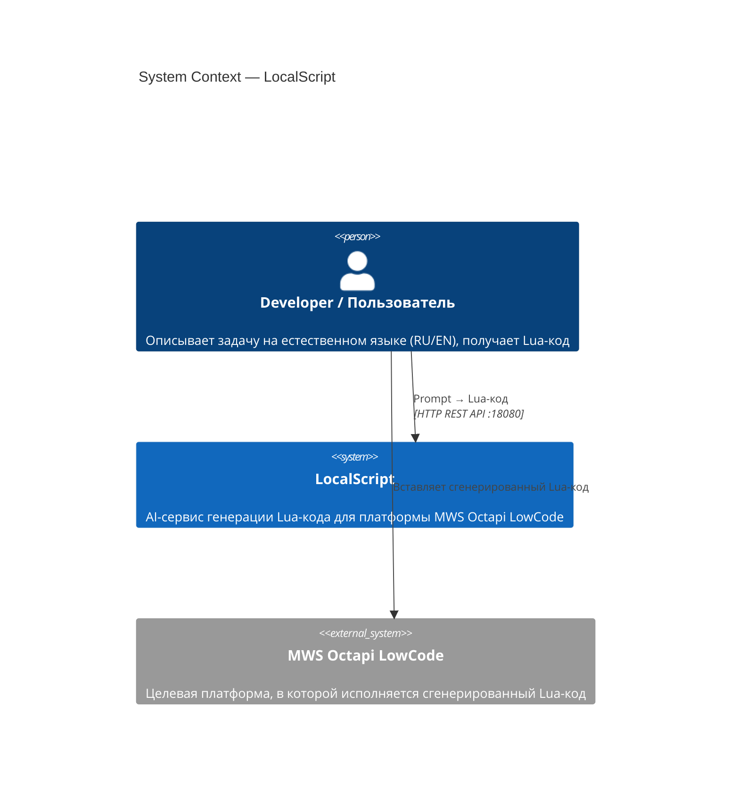
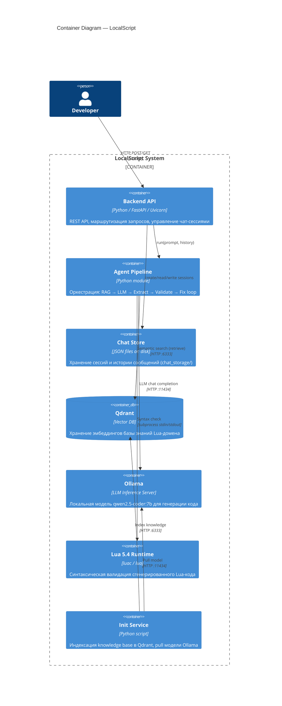
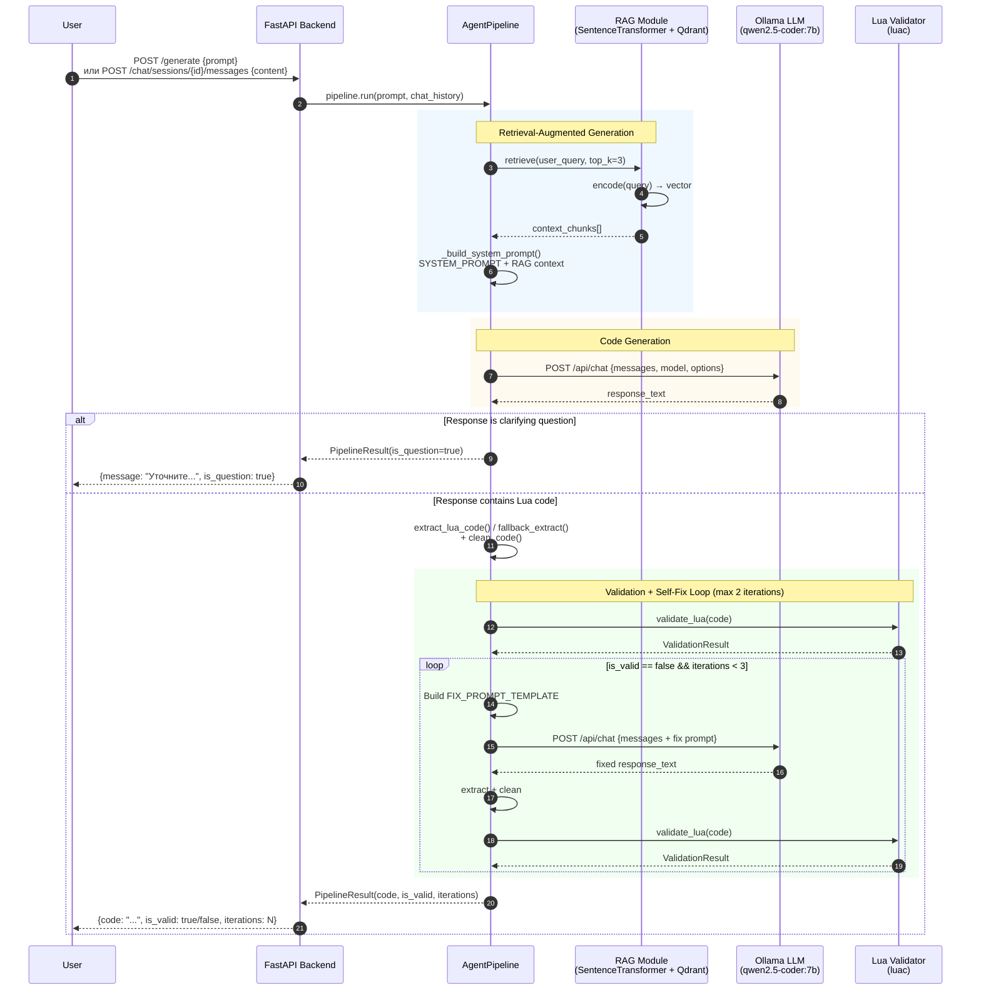
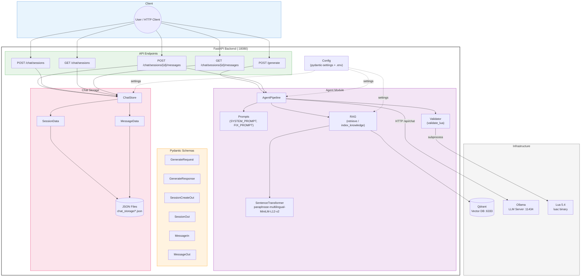
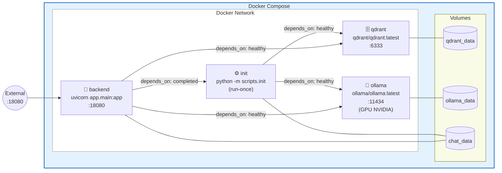

# LocalScript — Architecture Diagrams

---

## 1. C4 Level 1 — System Context

---

## 2. C4 Level 2 — Container Diagram

---

## 3. Agent Pipeline — Sequence Diagram

---

## 4. Backend — Component Diagram

---

## 5. Docker Compose — Deployment Diagram

